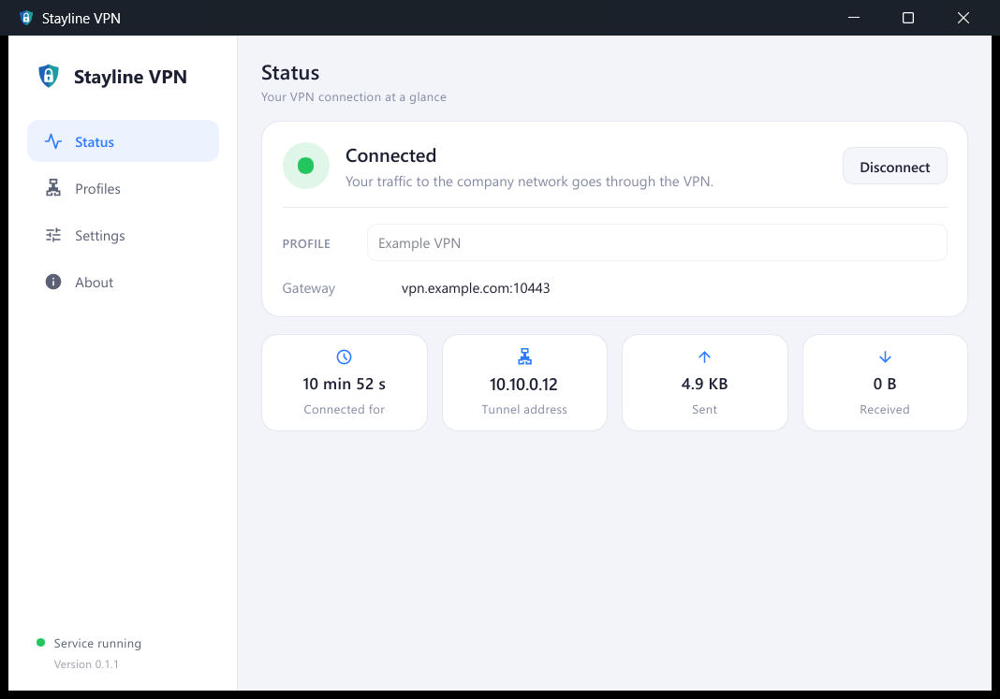
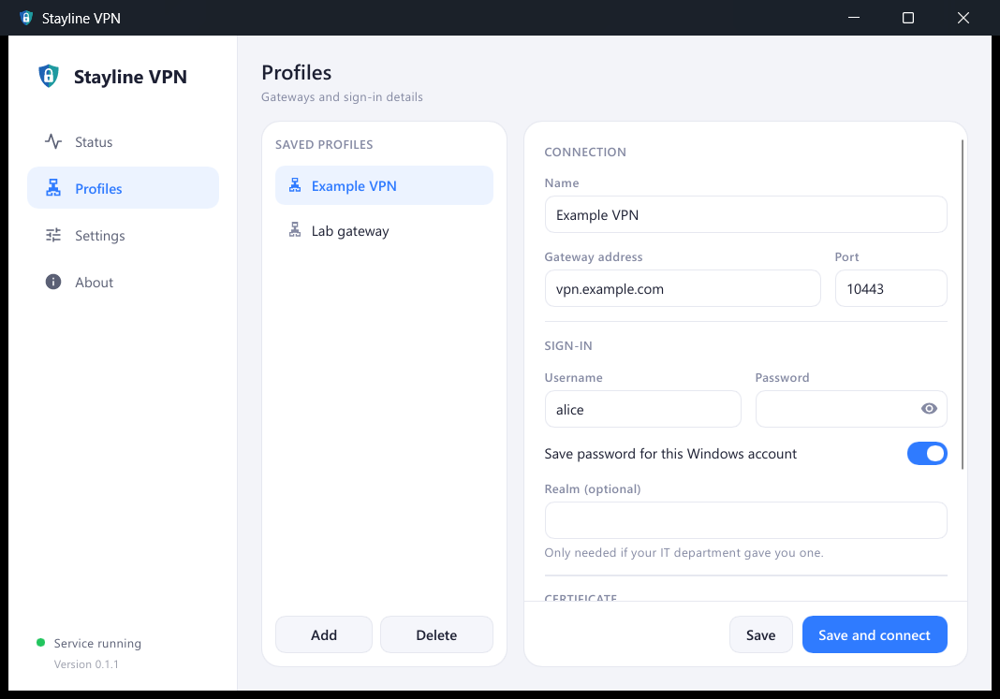
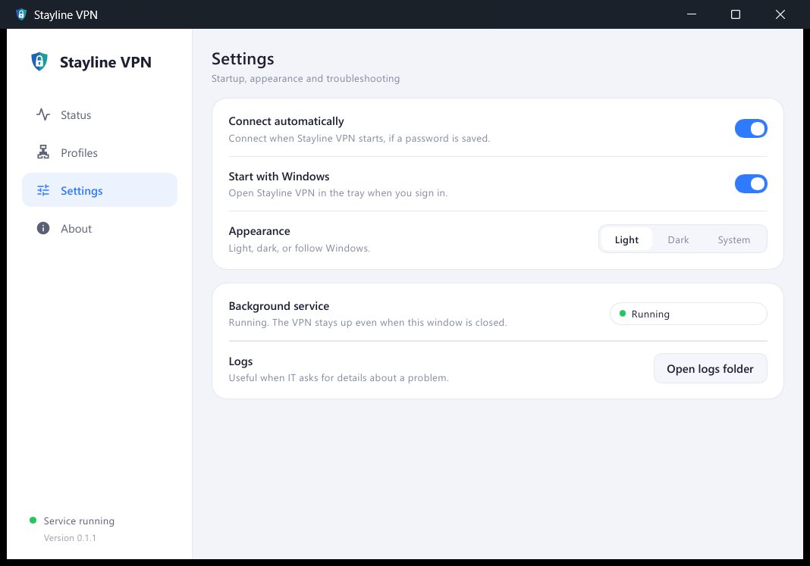

<p align="center">
  
</p>

<h1 align="center">Stayline VPN</h1>

<p align="center">
  A lightweight Windows client for FortiGate SSL-VPN that stays connected.
</p>

<p align="center">
  <a href="https://github.com/priyansx01/stayline-vpn/actions/workflows/ci.yml"></a>
  <a href="https://github.com/priyansx01/stayline-vpn/releases/latest"></a>
  <a href="#license"></a>
  
</p>

<p align="center">
  
</p>

Stayline VPN connects to an existing FortiGate SSL-VPN gateway and keeps the tunnel up. When Wi-Fi drops, you switch networks or the laptop sleeps, it reconnects on its own — no password prompts, no clicking Connect again.

## Features

- **Stays connected** — detects drops within seconds and reconnects silently, with back-off and offline detection.
- **Saved passwords, safely** — optional, encrypted with Windows DPAPI for your Windows account only.
- **Certificate pinning** — trust a self-signed gateway once, get warned if its certificate ever changes.
- **Service + tray design** — the tunnel lives in a Windows service; closing the app never drops the VPN.
- **Built for IT** — company installers with the connection built in, so employees only type their username and password.
- **Small** — written in Rust, designed to stay under 30 MB of RAM.

Works with any FortiGate SSL-VPN gateway using username and password sign-in (split or full tunnel). Not supported: SAML, token codes in the app, IPsec, posture checks, macOS and Linux.

## Install

1. Download `stayline-<version>.msi` from the [latest release](https://github.com/priyansx01/stayline-vpn/releases/latest) — or use the installer from your IT department.
2. Run it. Stayline VPN starts automatically and at every sign-in.
3. In **Profiles**, add your gateway address and username (skip this if IT set it up), then press **Connect** on the **Status** page.

See the [user guide](docs/user-guide.md) for details. If FortiClient is connected, disconnect it first.

<p align="center">
  
  
</p>

## For IT departments

Build an installer with your gateway and certificate pin built in, or pass them to the generic MSI through Intune or Group Policy:

```powershell
msiexec /i stayline-0.1.1.msi GATEWAY=vpn.example.com:10443 PIN=<sha256> CONNECTIONNAME="Example VPN" /qn
```

The [deployment guide](docs/deployment.md) covers company installers, all options, certificate pins and managing connections.

## How it works

The `stayline-svc` Windows service logs in to the gateway, runs PPP over TLS and drives a [Wintun](https://www.wintun.net) adapter with the routes and DNS the gateway assigns. It watches LCP echoes and Windows network events, keeps the adapter in place during a drop and reconnects as soon as the network is back. The `stayline-tray` app talks to the service over a named pipe and only shows state and asks for input. Read more in [architecture](docs/architecture.md).

## Building from source

Requires Windows, the MSVC build tools and [rustup](https://rustup.rs) (the toolchain is pinned in `rust-toolchain.toml`).

```powershell
cargo build --workspace
cargo test --workspace
powershell -ExecutionPolicy Bypass -File scripts\build-installer.ps1   # MSI, needs the .NET SDK
```

See [building](docs/building.md) for running the service from a build and testing against a gateway with `stayline-probe`.

## Project layout

| Path | Contents |
| --- | --- |
| [`crates/core`](crates/core) | FortiGate protocol, TLS and pinning, PPP, reconnect supervisor (platform independent) |
| [`crates/net`](crates/net) | Windows networking: Wintun adapter, routes, DNS, network-change events |
| [`crates/svc`](crates/svc) | Windows service and admin commands |
| [`crates/tray`](crates/tray) | Desktop app (Slint UI), tray icon, notifications |
| [`crates/config`](crates/config) | Company and user settings, saved passwords |
| [`crates/ipc`](crates/ipc) | Messages between the app and the service |
| [`crates/probe`](crates/probe) | Developer CLI for testing a gateway |
| [`packaging`](packaging) | WiX installer source and licence-notice templates |
| [`scripts`](scripts) | Build, installer, notice and asset scripts |
| [`assets`](assets) | Logo, icon and installer artwork |
| [`docs`](docs) | User, deployment, architecture and build documentation |

## Contributing

Contributions are welcome — please read [CONTRIBUTING.md](CONTRIBUTING.md) and follow the [code of conduct](CODE_OF_CONDUCT.md). Report security issues privately as described in [SECURITY.md](SECURITY.md). Changes are listed in the [changelog](CHANGELOG.md).

## License

Licensed under either of

- Apache License, Version 2.0 ([LICENSE-APACHE](LICENSE-APACHE))
- MIT license ([LICENSE-MIT](LICENSE-MIT))

at your option.

## Acknowledgements

- The UI is built with [Slint](https://slint.dev), used under its royalty-free licence, which requires the "Made with Slint" attribution shown on the About page.
- [Wintun](https://www.wintun.net) by WireGuard LLC provides the network adapter.
- Protocol behaviour was learned from [openfortivpn](https://github.com/adrienverge/openfortivpn); no openfortivpn code is included.
- Every open-source component and its licence is listed on the About page and in [THIRD-PARTY-NOTICES.html](THIRD-PARTY-NOTICES.html).

Stayline VPN is not affiliated with or endorsed by Fortinet, Inc. FortiGate and FortiClient are trademarks of Fortinet, Inc.
